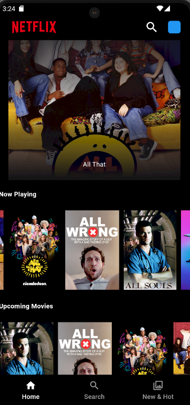

# Netflix Clone

 

## Description

A Netflix-like application built using Flutter that allows users to browse, search, and view details of movies and TV shows. The app features a user-friendly interface, movie recommendations, and integrates with a movie database API to fetch real-time data.

## Features

- **Search Movies and TV Shows**: Quickly find your favorite titles.
- **Movie Details**: View detailed information about each movie, including genres, release dates, and overviews.
- **Recommendations**: Discover more content similar to what you love.
- **Responsive Design**: Works seamlessly across various devices and screen sizes.

## Tech Stack

- **Frontend**: Flutter
- **State Management**: Cubit (Flutter Bloc)
- **HTTP Requests**: Dio
- **Caching**: Cached Network Image
- **Design**: Material Design Guidelines

## Getting Started

To run this project locally, follow these steps:

1. **Clone the Repository**
   ```bash
   git clone https://github.com/ShivTiwari0/NetFlix-Clone-Bloc.git
   cd netflix_clone

2. **Install Dependencies**   
   flutter pub get

3. **Run the App**  
   flutter run 


**Acknowledgements**
Flutter - The framework used for building the app.
Dio - For making network requests.
Cached Network Image - For caching images.

   


### Instructions to Customize:
- **Screenshots**: .
- **Repository URL**: https://github.com/ShivTiwari0/NetFlix-Clone-Bloc.git.
- **Email**: shivansh.tiwari130899@gmail.com


